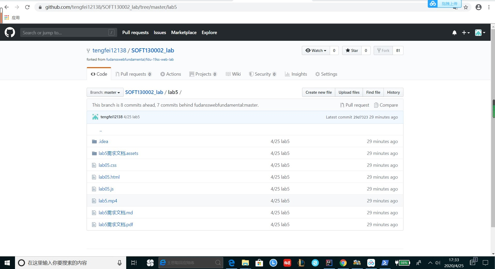
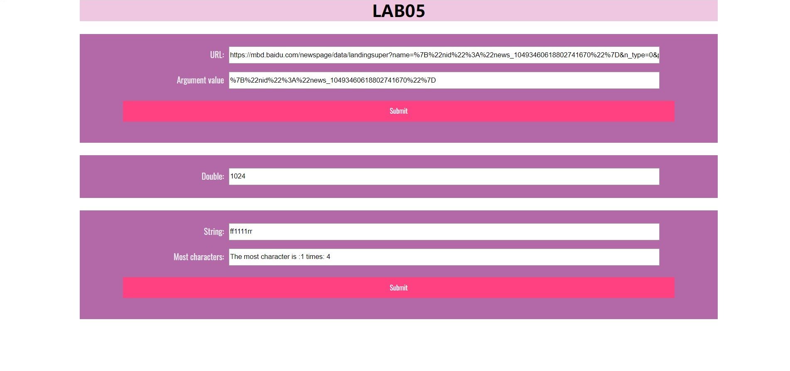

##lab5设计文档
陈思帆 &nbsp;&nbsp; 19302010046  
***
* 1.获取url中名为name的参数。  
解决思路及方法：利用split方法先截取“？”后的字符串，再以“&”分割获得类似["name=mark","age=100"]的
数组，然后遍历数组的每一个元素，每遍历一个元素后使用split方法以“=”分割，得到类似["name","mark"]的
数组，然后用if语句判断数组的首位元素是否为“name”，若是，便将该数组的次位元素赋给url_result.value.
当url中无name参数时，默认取“？"后的第一个参数值。
***
* 2.每隔五秒运行一次函数直到一分钟停止，或者运行十次，先到的为准。
解决思路及方法：利用Date()创建对象start和now（可通过getMinutes（）获得当前分钟），后利用setInterval（function，5000）间隔指定的毫秒数执行指定的代码。  
其中function函数设置初始m=0用于累计运行次数，每运行一次进行如下判断now.getMinutes()!==start.getMinutes()||++m>10  
若为true则利用clearInterval（）停止setInterval（）方法执行的代码。
最后使用window.onload = timeTest;即当页面加载完成后立刻执行timeTest函数。
***
* 3.判断输入框most里出现最多的字符，并统计出来.
解决思路及方法：将用户输入的字符串赋给创建的两个字符串str和str1，后创建一个与字符串str长度相等的数组，并
利用fill（）使数组初始化，该数组用于计算用户输入的字符串中各个字符出现的次数。  
然后利用两次循环，外部循环为str，内部循环为str1，将str的每个元素与str1的所有元素进行比对，若相同，则该字符所在位置对应的
计数数组次数加1。  
最后遍历计数数组，找出数组中最大的数，并记录其位置index，即输入框中出现最多的字符便是str.charAt(index),出现的次数便是计数数组中最大的数，
***

***

