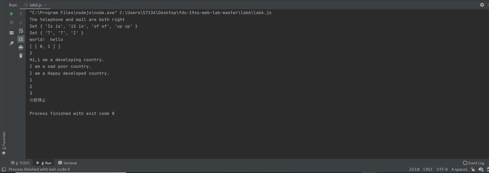
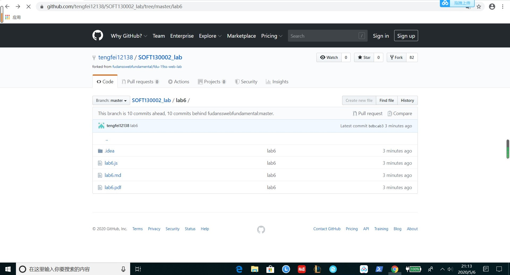

###Lab6 设计文档
***
19302010046 陈思帆  
*正则表达式的解释  
1.邮箱的正则表达式  
/^([A-Za-z0-9_\-\.])+\@([A-Za-z0-9_\-\.])+\.([A-Za-z]{2,4})$/  
\^ ：匹配输入的开始位置。   
\：将下一个字符标记为特殊字符或字面值。   
\* ：匹配前一个字符零次或几次。   
\+ ：匹配前一个字符一次或多次。   
[a-z] ：表示某个范围内的字符。与指定区间内的任何字符匹配。   
$ ：匹配输入的结尾。   
 
定义邮箱规则如下:  
* 以大写字母[A-Z]、小写字母[a-z]、数字[0-9]、下滑线[_]、减号[-]及点号[.]开头，并需要重复一次至多次[+]。
中间必须包括@符号。  
* @之后需要连接大写字母[A-Z]、小写字母[a-z]、数字[0-9]、下滑线[_]、减号[-]及点号[.]，并需要重复一次至多次[+]。  
* 结尾必须是点号[.]连接2至4位的大小写字母[A-Za-z]{2,4}。
  
2.匹配连续单词的正则表达式  
/\b([a-z]+) \1\b/ig;  
* 捕获的表达式，正如 [a-z]+ 指定的，包括一个或多个字母。  
* 正则表达式的第二部分是对以前捕获的子匹配项的引用，即，单词的第二个匹配项正好由括号表达式匹配。  
* \1 指定第一个子匹配项。  
* 单词边界元字符 \b 确保只检测整个单词。否则，诸如 "is issued" 或 "this is" 之类的词组将不能正确地被此表达式识别。  
* 正则表达式后面的全局标记 g 指定将该表达式应用到输入字符串中能够查找到的尽可能多的匹配。  
* 表达式的结尾处的不区分大小写 i 标记指定不区分大小写。
***
*继承不同方式的理解。  
* 原型链继承:让新实例的原型等于父类的实例。  
实例可继承父类构造函数和原型的属性，但新实例不能继承父类实例的属性。  
继承方式单一，且由于原型上的属性是共享的，一旦一个实例修改了原型属性，另一个属性的原型属性也随之被修改。
  
 * 构造函数继承（经典继承)：使用call方法更改函数的作用环境，将子类中的变量在父类中执行一遍，由于父类中是给this绑定属性的，
 因此子类自然基础父类构造函数的属性。  
 但未涉及原型，所以父类的原型方法不会被子类继承。无法实现构造函数的复用。  
 
 * Object.creat继承：使用一个指定的原型对象和一个额外的属性对象创建一个新对象。  
 一个新的对象可继承一个对象的属性，且可自行添加属性。除却兼容性问题，实现继承的最简洁完善的方式。  
 
 ***
 3.Map，Set，Array的区别和使用。  
   
 * Array数组：Array 中存储的元素是有序可以重复的，长度是可以动态改变，存储的元素可以是任意的数据类型。
   
   使用：除去基本的增删改查函数外，数组的sort（）可使数组元素按字典序排列，Array.from()将类数组对象或可遍历对象
   转换成真正的数组，reverse（）函数可实现数组元素的倒转。  
 
 * Set集合：类似于数组，但成员的key值都是唯一的，没有重复的值。一般便于数据去重。  
   使用：仅有增删五修改和查找方法，foreach方法可用于遍历，has（）函数可检测参数是否为set的成员，clear（）函数清除
   所有成员。涉及到成员顺序及修改问题，一般转化为数组再操作。  
 
 * Map数据结构：map存储的是有序、key不能重复的键值对。具有极快的查找速度。  
   使用：具有基本增删改查函数。map可以对象object互相转化。has（）判断map对象中是否有key所对应的值，有返回true，无则返回false；  
   get（）通过键值查找特定的数值并返回。
   
  
***

